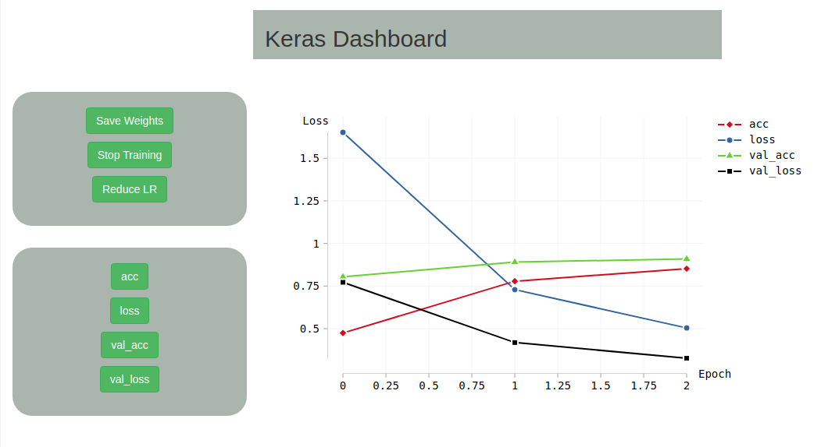

# Keras Dashboard **WIP**
A simple dashboard to monitor your keras experiment. Just use the KerasRemote callback in your model!

## Why?
* Your network is not learning and you need to reduce the learning rate.
* You want to save the weights to test them.
* You want to stop the training without killing your process
* And More! (Feature requests welcome!)


## Why Elm?
[Elm](http://elm-lang.org/) is a functional language that I really like! It allows me to quickly write the frontend without ever having runtime issues.

## Requirements
* Keras
* [SimpleWebSocketServer](https://github.com/dpallot/simple-websocket-server)

## How to run the frontend
```bash
npm install -g elm
elm package install
npm install
gulp
```

The webpage is now accessible! (This image has been taken on May 11 so it may differ from the actual view)



## Contributing/TODO
Feel free to submit issues/PR for the following areas:
* CSS **IMPORTANT**
* New Features
* Multi-experiments at the same time
* Documentation
